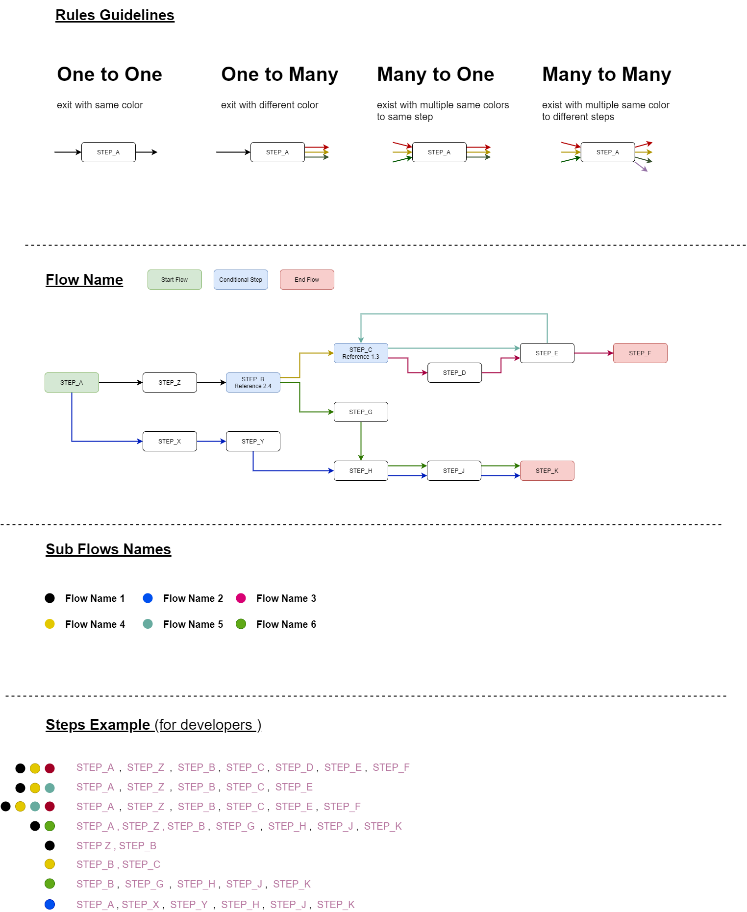

# Flow Manager Usage Guide
Flow Manager help you to manage flow information by determine the current step, next step and define the set of conditions that satisfy the steps.
<br/>
Flow Manger using [XState](https://github.com/davidkpiano/xstate) for state machine to calculate where are you currently in the flow and where you need to go.

!!! note "Harmony 2.0 Flow Manager"
    Harmony 2.0 contains flow manager by default and is ready to use.

## Motivation

redux-flow-manager created to help you manage application with complex flows. <br />
In the flow diagram below you can see example of one flow that can be in your application. <br />
In that flow diagram, each **color is sub flow**, and green and red steps are start and end flow. <br />
Redux Flow Manager help you to manage this sub flows and get decisions where you are and where you need to go.<br />

<br />



## Usage

### Files
In Harmony there are few files and folders you need to get familiar with in order to use Flow Manager.

- `src/config/flow-manager` - This folder contains the flow, sub-flow and types definition.
- `src/modules/sdk/hooks/flow-manager` - This folder contains the hooks and conditions that are used to manage the flow.

#### useFlowManager
This is the main hook that you will use to manage the flow in your application. <br />

| Method | Description |
|--------|-------------|
| `getFlowInformation()` | Retrieves the current flow information including flow type, sub flow type, current step, next step, and steps. |
| `startFlow(flowType, currentStep, isMoveToStep)` | Starts the flow with the specified type and initial step. Optionally moves to the specified step. |
| `endFlow()` | Ends the current flow and clears all data from the flow manager. |
| `moveToNextStep(step?, isUpdateInformation)` | Moves to the next step in the flow. Optionally updates the flow information. |
| `moveToPrevStep(step, isUpdateInformation)` | Moves to the previous step in the flow. Optionally updates the flow information. |
| `isLastStep()` | Checks if the current step is the last step. |
| `isFirstStep(steps, currentStep)` | Checks if the current step is the first step in the flow. |
| `isStepIncludedInFlow(stepName)` | Checks if the specified step is included in the current flow. |
| `calculatePreviousStep(steps, chosenStep)` | Calculates the previous step based on the current steps and the chosen step. |

#### Code example

Start COP flow with the first step in the flow.

```TS
const onStartBuyFlow = async () => {
    const {startFlow} = useFlowManagerApi(navigate);
    startFlow(flowsTypes.flowTypes.COP,
        (flowsTypes as TypesConfig).stepTypes.DEVICE_GALLERY.name, true);
};
```
Move to the next step in the flow.

```TS
const onMiniCartContinue = async () => {
    const { moveToNextStep } = useFlowManagerApi(navigate);
    moveToNextStep();
};
```
