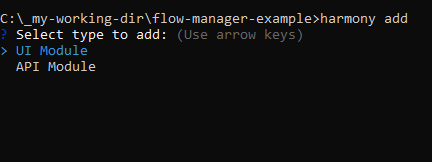
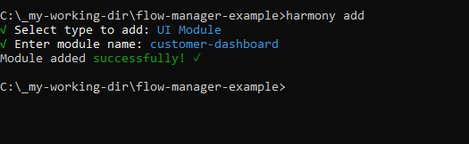
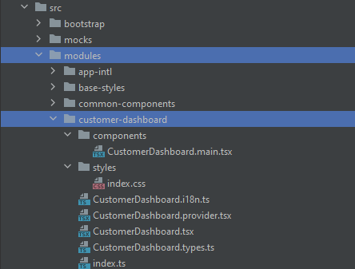
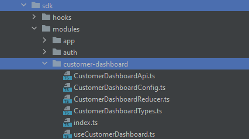

# Generate Modules

Harmony gives you the option to create a module with a single command, and it will create all the necessary files for you.
The module types supported by Harmony are:

- `ui`
- `api`


## Create Module by cli

``` sh
harmony2 add [type] [name]    // Add a new module
harmony2 add api [name]     // Add a new API module
harmony2 add ui [name]      // Add a new UI module
```
   

### Create UI Module by cli

When Adding a UI module, it will create a folder with the name of the module in the `src/modules/` directory and create the following files:



- `components/<module-name>.main.tsx` - The main business component file for the module.
- `styles/index.css` - The style file for the module.
- `<module-name>.i18n.ts` - The index file for the module translation.
- `<module-name>.provider.tsx` - The module provider component.
- `<module-name>.tsx` - The module main component file exporting the module.
- `<module-name>.types.ts` - The module types file already populated with the Harmony basic types.
- `index.ts` - The module main file exporting the module and its types.

Other than creating the folders and files, it will also add the module to the following files:

- `src\modules\app-intl\Intl.i18n.ts` - The main translation file.
- `tsconfig.app.json` - The main typescript configuration file to include the module path.
- `vite.config.ts` - The main build configuration file to include the module path.


### Create API Module by cli

When Adding a UI module, it will create a folder with the name of the module in the `src/modules/sdk/modules/` directory and create the following files:



- `<ModuleName>Api.ts` - The module API file containing examples of end-points, base query, redux data persisting and more.
- `<ModuleName>Config.ts` - The module configuration file exposing the slice name, api name and other store related data.
- `<ModuleName>Reducer.tsx` - The module main reducer file with basic initial state, data persisting and action handling.
- `<ModuleName>Types.ts` - The module types with basic example for Actions and State.
- `index.ts` - The module main file exporting the API module and its types.
- `use<ModuleName>.ts` - The module main hook file.

Other than creating the folders and files, it will also add the module to the following files:

- `src\modules\sdk\modules\index.ts` - The main SDK file exporting all the modules.
- `src\modules\sdk\store.ts` - The main SDK store file including and exporting all the reducers and APIs.
