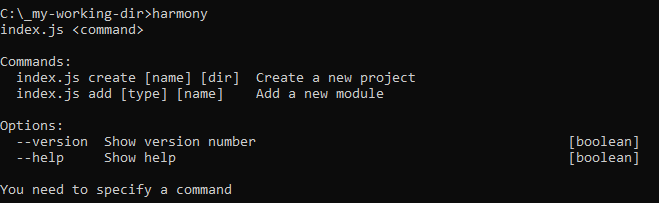
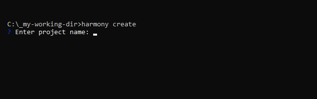
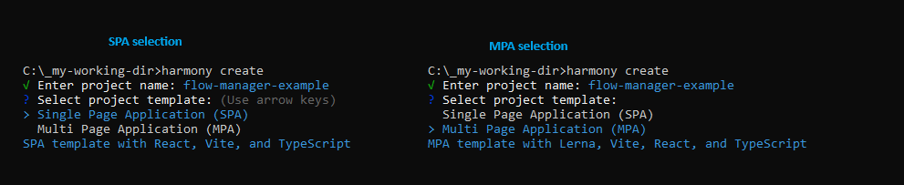
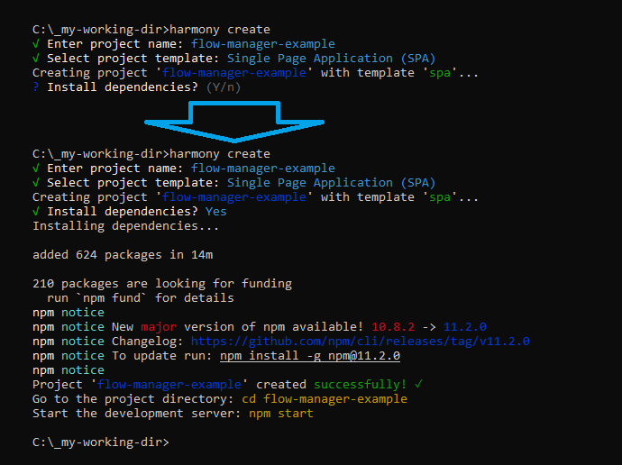

## Introduction

!!! tip "How to read Harmony Documentation"

    Harmony Documentation built by steps to make it easy for you to get started and
    understand the full framework.<br/>
    Please following the `Next` button at the bottom of the page.

Harmony is a starter-kit to enable fast on-boarding when it comes to developing web applications with the focus on React Redux and NodeJS.
Harmony suggest new features and improve your flexibility by adding your customized features.

Harmony Boilerplate focus on performance and Best Practices to build the most updated web application

## Creation
To create a Harmony based project, you can use the Harmony CLI to create a new project.
This will present a menu to select if you want a Single Page Application (SPA), or a Multi Page Application (MPA) and some other info required for the project.

| Description                                           | Command                    | Image                                                                                                                                                                            |
|-------------------------------------------------------|----------------------------|----------------------------------------------------------------------------------------------------------------------------------------------------------------------------------|
| Harmony CLI                                           | ```$ npx harmony2 ```       |                                                                                                                                     |
| Harmony CLI Create Project                            | ```$ npx harmony2 create``` |                                                                                                                                    |
| Harmony CLI - <br/> 1. Select SPA\MPA<br/> 2. Install |     | <br/> <br/> |

``` sh
$ npx harmony2 create <my-app> <location>
#<my-app> is the project name and is optional
#<location> is the project location to create
``` 

## Installation
Enter to the Newly created folder and install the dependencies (if not done by CLI).

``` sh
$ npm install
```

## Execution

### Run the Project

Run for Development
``` sh
$ npm start
```

Run for Production
``` sh
$ npm run build
```
### Run Storybook

``` sh
$ npm run storybook
```


Congratulations, you start your first Harmony web app.
Now go on and explore how to develop your next webapp easily with our feathers.

