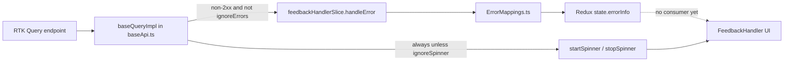

# Feedback Handler & API Error Handling — Investigation

## Executive summary

Before this cleanup, the docs page published at
`/docs/extensions/client/error-handler` (file `ClientErrorHandlerPage.tsx`)
described a **Harmony 1.x** mechanism (`error.config.json`,
`@withErrorHandler`, `src/containers/ErrorHandler/`,
`STRICT_CONSOLE_ERROR`) that **does not exist anywhere** in harmony-2.0.
That page has been replaced by
[`ClientFeedbackHandlerPage.tsx`](../src/pages/docs/ClientFeedbackHandlerPage.tsx)
and the route moved to `/docs/extensions/client/feedback-handler`. A
redirect from the old path is kept in
[`pages-config.tsx`](../src/bootstrap/pages-config.tsx) so inbound links
keep working.

In harmony-2.0 the same responsibility — catching API failures and reacting
to them in one place — is owned by the **feedback-handler** module. The
module is split across two layers:

- **SDK layer** ([`src/base-modules/sdk/modules/feedback-handler/`](../src/base-modules/sdk/modules/feedback-handler))
  owns the Redux slice, the RTK Query API, the error→display mappings, and
  the `useFeedbackHandler()` hook.
- **UI layer** ([`src/base-modules/feedback-handler/`](../src/base-modules/feedback-handler))
  owns the `<FeedbackHandler />` component that mounts the global spinner,
  snackbars and modals.

This document is the source of truth for what is real today, what the docs
got wrong, and how the docs page should be rewritten.

---

## What the published page says vs. what the code does

| Documented (legacy, wrong) | Actual implementation in harmony-2.0 |
| --- | --- |
| `src/configurations/error.config.json` | **Does not exist.** No `src/configurations/` folder at all. |
| Handler keys `<errorCode>_<statusCode>` | Matching by `status`, `code`, `message`, `characteristics` in [`ErrorMappings.ts`](../src/base-modules/sdk/modules/feedback-handler/ErrorMappings.ts). |
| Handler types `modal`, `notification`, `ignore` | `handleError` reducer stores an `ErrorInfoType` (with optional `displayedError`) on `state.feedbackHandler.errorInfo`. |
| `@withErrorHandler` decorator | **Not implemented.** No decorator and no `containers/ErrorHandler/` folder. |
| `src/containers/ErrorHandler/index.tsx` & `withErrorHandler.tsx` | **Do not exist.** |
| `STRICT_CONSOLE_ERROR` in `src/config.ts` | **Does not exist.** `DevelopWithHarmonyPage` mentions "the feedback handler treats runtime errors as blocking" but there is no flag. |

The accurate (partial) description of the real flow already lives under
**Requests → Error handling** in
[`ClientRequestsPage.tsx`](../src/pages/docs/ClientRequestsPage.tsx).

---

## How API errors flow today



### Capture — base query

Every RTK Query request runs through
[`baseQueryImpl`](../src/base-modules/sdk/services/baseApi.ts). On a non-2xx
response (or a thrown exception) it dispatches
`feedbackHandlerSlice.actions.handleError`, unless the endpoint opts out
via `extraOptions.ignoreErrors`. The same wrapper also drives the global
spinner via `startSpinner` / `stopSpinner` (opt out with
`extraOptions.ignoreSpinner`).

### Mapping — reducer + ErrorMappings.ts

[`FeedbackHandlerReducer.handleError`](../src/base-modules/sdk/modules/feedback-handler/FeedbackHandlerReducer.ts)
builds an `ErrorInfoType`, short-circuits on `401`/`403` (login redirect
is a planned follow-up), and otherwise picks a matching entry from
[`ErrorMappings.ts`](../src/base-modules/sdk/modules/feedback-handler/ErrorMappings.ts)
in this priority order:

1. App-specific `errorMappings` matched by **characteristics**.
2. App-specific `errorMappings` matched by **status / code / message**.
3. Generic `commonErrors` matched by **characteristics**.
4. Generic `commonErrors` matched by **status / code / message**.
5. Fallback to the `commonErrors` entry for status `500`.

The matched `displayedError` is stored on `state.feedbackHandler.errorInfo`.

### Snackbars and modals — user feedback queue

Snackbars and modals are driven by a separate `feedbacks` queue (not by
`errorInfo`):

- `useFeedbackHandler().pushFeedback({ code, values })` appends to the
  queue.
- The display config for each `code` comes from `feedbacksConfig`, which
  the mock server returns at
  [`GET {apiBaseUrl}/feedback-config`](../src/base-modules/mocks/handlers/feedbackMockHandler.ts).
- [`FeedbackHandler.provider.tsx`](../src/base-modules/feedback-handler/FeedbackHandler.provider.tsx)
  joins the two and exposes ready-to-render `snackbars` / `modals` arrays
  through `useFeedbackHandlerContext()`.

### UI mount

`<FeedbackHandler />` is mounted in the existing layouts:

- [`src/bootstrap/docs-layout.tsx`](../src/bootstrap/docs-layout.tsx)
- [`src/bootstrap/landing-layout.tsx`](../src/bootstrap/landing-layout.tsx)
- [`.storybook/StorybookLayout.tsx`](../.storybook/StorybookLayout.tsx)

It renders a `SpinnerWidget`, a `Snackbars` container and a `Modals`
container.

---

## Configuration reference

### `ErrorMappings.ts`

```ts
export interface ErrorMatchCriteria {
  status?: number | null;
  code?: string | null;
  message?: string | null;
  characteristics?: string[] | null;
}

export interface DisplayedError {
  title: string;
  description: string;
  showMoveHomeButton: boolean;
  navigationRoute?: string;
  buttonText?: string;
}

export interface ErrorMapping {
  error: ErrorMatchCriteria;
  displayedError: DisplayedError;
  isPartialMatch?: boolean;
}
```

Two arrays are exported:

- `errorMappings` — app-specific, edit freely.
- `commonErrors` — generic HTTP-status fallbacks (400/404/405/408/500/503).
  Treat as defaults; touch only when required.

Setting `isPartialMatch: true` switches `message` / `characteristics`
matching from strict equality to `String.prototype.includes`. Use
sparingly — partial matches can silently swallow unrelated errors.

### Per-endpoint opt-outs

```ts
type ExtraOptionsType = {
  ignoreSpinner?: boolean | ((params: string | FetchArgs) => boolean);
  ignoreErrors?: boolean | ((params: string | FetchArgs) => boolean);
};
```

Set on an RTK Query endpoint definition via `extraOptions`. Both options
accept a function of the request args, which is useful when one endpoint
mixes critical and silent calls.

---

## Public API surface

From `@sdk`:

- `useFeedbackHandler()` — bound dispatchers for `pushFeedback`,
  `removeFeedback`, `updateConfig`, `startSpinner`, `stopSpinner`,
  `clearErrorInfo`, `handleError`.
- `feedbackHandlerApi` — RTK Query API exposing `loadConfig`
  (`GET /feedback-config`).
- Types: `FeedbackConfigType`, `FeedbackHandlerConfigType`,
  `ErrorResponse`, `ErrorInfoType`, `DisplayedErrorType`,
  `PushFeedbackPayloadType`.

From `@feedback-handler`:

- `FeedbackHandler` — the component to mount once per layout.
- `useFeedbackHandlerContext()` — context exposing `isSpinnerActive`,
  `snackbars`, `modals`, `userInfo`, `navigate`, plus the slice actions.

---

## Known gaps (call out honestly in the docs)

1. **`errorInfo` has no UI consumer yet.** `handleError` writes
   `errorInfo` (with the matched `displayedError`) into Redux, but no
   component under `src/base-modules/feedback-handler/` reads it. Until
   a consumer is added, API errors only show up in the developer
   console.
2. **`Snackbars` and `Modals` are placeholders.** The components in
   [`src/base-modules/feedback-handler/components/`](../src/base-modules/feedback-handler/components)
   render the queues but the styling and behavior are stubs.
3. **`loadConfig` is not wired.** `feedbackHandlerApi.loadConfig` exists
   and the mock server responds at `/feedback-config`, but nothing calls
   `loadConfig` or dispatches `updateConfig`, so `feedbacksConfig` stays
   empty in production-like flows.
4. **`401` / `403` are intentionally ignored** by `handleError` with a
   TODO comment about routing to a login page. Document this as planned
   behavior, not a bug.
5. **`@withErrorHandler` is not planned.** harmony-2.0 prefers
   `extraOptions.ignoreErrors` plus reading `errorInfo` from a
   component, rather than a class-component decorator.

---

## Documentation fix checklist

1. **Rewrite the docs page.** Replace the old
   `ClientErrorHandlerPage.tsx` with
   [`ClientFeedbackHandlerPage.tsx`](../src/pages/docs/ClientFeedbackHandlerPage.tsx)
   covering:
   - Concept: unified feedback system (spinner + snackbars/modals +
     API error mapping).
   - Setup: mount `<FeedbackHandler />` inside a layout that already
     provides the SDK store.
   - API error handling: the `baseApi → handleError → ErrorMappings.ts`
     flow, with an example `ErrorMapping`.
   - User feedback: `pushFeedback({ code, values })` and the
     `feedbacksConfig` shape (mocked at `/feedback-config`).
   - Opt-out: `extraOptions.ignoreErrors` / `ignoreSpinner` with a short
     TS example.
   - Customization: edit `ErrorMappings.ts` for API errors, extend
     `FeedbackHandler` components for presentation.
   - Migration callout: how to map the old `error.config.json` /
     `@withErrorHandler` mental model to the new APIs.
2. **Rename the route.** Update
   [`routes.ts`](../src/base-modules/sdk/consts/routes.ts) to
   `DOCS_CLIENT_FEEDBACK_HANDLER: '/docs/extensions/client/feedback-handler'`,
   the sidebar label in
   [`nav.ts`](../src/base-modules/sdk/consts/nav.ts) to **Feedback
   Handler**, and the lazy entry in
   [`pages-config.tsx`](../src/bootstrap/pages-config.tsx). Add a
   redirect from the old `/error-handler` path so existing inbound links
   keep working.
3. **Export the new page** from
   [`src/pages/docs/index.ts`](../src/pages/docs/index.ts) and remove
   the stale `ClientErrorHandlerPage` re-export.
4. **Cross-link** the **Requests → Error handling** section to the new
   page.
5. **Verify** that the repo has no remaining references to
   `error.config.json`, `withErrorHandler`, or `containers/ErrorHandler`
   outside this investigation README.

## Out of scope (suggested follow-ups)

- [`ClientGlobalSpinnerPage.tsx`](../src/pages/docs/ClientGlobalSpinnerPage.tsx)
  also leans on the legacy `containers/ErrorHandler` and a non-existent
  `spinner.config.json`. It needs the same cleanup pass.
- Build the missing `errorInfo` UI (a global error modal/page reading
  `useAppSelector(s => s.feedbackHandler.errorInfo)`).
- Wire `feedbackHandlerApi.loadConfig` → `updateConfig` on app start so
  `feedbacksConfig` is populated.
